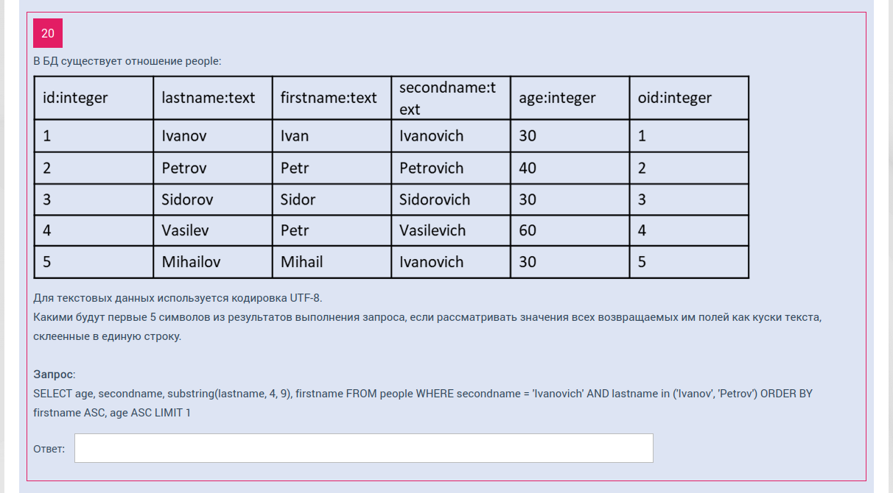

# SELECT в SQL 3

Самое творческое задание для меня!

1) Сперва распознаем текст на изображении в файлик __table.txt__, чтобы не вводить ничего ручками:

    https://www.imagetotext.info/ru/image-to-text

2) Затем напишем скрипт __convert_to_insert.py__, который сформирует для нас insert-запросы в БД. После чего напишем файлик для создаиня БД.

3) Вставим код из __inserts.sql__ на какой-нибудь sql-онлайн сайтец.
    
    https://sqliteonline.com/

4) И, наконец, сделаем 20 требуемых по тесту запросов!

# Схема БД

