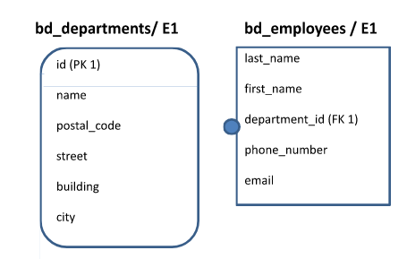

# SELECT в SQL 2

Полное дз для всех вариантов находится в файле **Лабораторная работа №2.docx**.

Запуск кода происходит через:

```bash
psql -U user -d db -f file.sql
```

# Схема БД



## Запрос 1

Напишите запрос, находящий всех сотрудников (таблица bd_employees), у которых номера телефонов записаны в правильной форме для Москвы: 8-тире-скобка-495 или 499-скобка-тире-три цифры-тире-две цифры-тире-две цифры. Например, «8-(495)-123-45-67».

## Запрос 2

Напишите запрос, находящий всех сотрудников (таблица bd_employees), у которых в номерах телефонов есть четыре цифры, идущие подряд, не в конце и не в начале строки. Например, «8-(912)-1234-567».

## Запрос 3

Напишите запрос, выбирающий фамилию сотрудника (поле last_name) и его адрес электронной почты (поле email) для всех сотрудников. Причем в адресе электронной почты все символы, начиная с третьего и до символа собаки, должны быть заменены на символ «\_». Например, «ma**ria1988**@mail.ru» должно быть заменено на «ma\_@mail.ru».

## Запрос 4

Напишите запрос, выбирающий всех сотрудников, у которых в имени не более трёх гласных букв.
