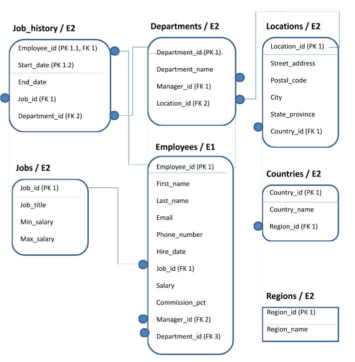

# Работа с PostgreSQL

Наконец-то что-то более-менее прикладное начали давать в университете, в данной лабе требуется попрактиковаться с наиболее важным для разработчика запросом _SELECT_. Задачи простые, условия напишу ниже. Полное дз для всех вариантов находится в файле **hw_5.docx**.

Спасибо автору [сайта](https://tabletomarkdown.com/convert-spreadsheet-to-markdown/), что мне не пришлось заполнять таблицы для примеров ниже вручную.

# Схема БД

# 4 вариант

## Запрос 1

Напишите запрос с использованием столбцов таблицы employees, выбирающий ФИО, оклад и оклад с вычтенным подоходным налогом.  Пример возможного результата выполнения запроса представлен в таблице ниже. Поля должны называться так же, как указано в примере.

| ФИО               | ОКЛАД    | Оклад минус подоходный |
| ----------------- | -------- | ---------------------- |
| Donald OConnell   | 2600,00  | 2262                   |
| Douglas Grant     | 2600,00  | 2262                   |
| Jennifer Whalen   | 4400,00  | 3828                   |
| Michael Hartstein | 13000,00 | 11310                  |
| Pat Fay           | 6000,00  | 5220                   |
| Susan Mavris      | 6500,00  | 5655                   |
| Hermann Baer      | 10000,00 | 8700                   |
| Shelley Higgins   | 12000,00 | 10440                  |
| William Gietz     | 8300,00  | 7221                   |
| Steven King       | 24000,00 | 20880                  |
| Neena Kochhar     | 17000,00 | 14790                  |

При этом сумму подоходного налога нужно считать равной 13 процентам.

## Запрос 2

Напишите запрос, выбирающий информацию об имени, фамилии, должности (столбец JOB_ID) и времени приема на работу (столбец HIRE_DATE) для сотрудников из таблицы employees. При этом должна возвращаться только информация о тех сотрудниках, которые были приняты на работу не в период с 1995 по 1999 годы включительно, плюс тех, чьи должности выглядят как AD_PRES, AD_VP и AD_ASST. Ограничьте число выводимых записей пятью. Используйте для этого запроса операторы BETWEEN и IN. Пример возможного результата выполнения запроса представлен в таблице ниже. Поля должны называться так же, как указано в примере.

| Имя      | Фамилия | Должность  | Дата приема на работу |
| -------- | ------- | ---------- | --------------------- |
| Douglas  | Grant   | SH_CLERK   | 13.01.2000            |
| Jennifer | Whalen  | AD_ASST    | 17.09.1987            |
| Susan    | Mavris  | HR_REP     | 07.06.1994            |
| Hermann  | Baer    | PR_REP     | 07.06.1994            |
| Shelley  | Higgins | AD_PRES    | 07.06.1994            |
| William  | Gietz   | AC_ACCOUNT | 07.06.1994            |
| Steven   | King    | AD_PRES    | 17.06.1987            |

## Запрос 3

Пусть идентификатор сотрудника − это два последних символа имени плюс три первых символа фамилии. Все символы идентификатора представлены в нижнем регистре. Напишите запрос, выбирающий из таблицы employees информацию об имени и фамилии сотрудника, а также идентификатор сотрудника в соответствии с поставленными условиями. Пример возможного результата выполнения запроса представлен в таблице ниже. Поля должны называться так же, как указано в примере. Новое поле в таблицу добавлять не нужно! Идентификатор получается при помощи запроса.

| Имя       | Фамилия  | Идентификатор |
| --------- | -------- | ------------- |
| Ellen     | Abel     | enabe         |
| Sundar    | Ande     | arand         |
| Mozhe     | Atkinson | heatk         |
| David     | Austin   | idaus         |
| Hermann   | Baer     | nnbae         |
| Shelli    | Baida    | libai         |
| Amit      | Banda    | itban         |
| Elizabeth | Bates    | thbat         |
| Sarah     | Bell     | ahbel         |

## Запрос 4

Напишите запрос, выбирающий информацию о максимальной, минимальной и средней заработной плате для каждой должности в таблице employees. Информация о заработной плате находится в столбце salary, а информация о должности — в поле job_id. Пример возможного результата выполнения запроса представлен в таблице ниже. Поля должны называться так же, как указано в примере.

| Должность  | Максимальная зарплата | Минимальная зарплата | Средняя зарплата |
| ---------- | --------------------- | -------------------- | ---------------- |
| AC_MGR     | 12000                 | 12000                | 12000.00         |
| AC_ACCOUNT | 8300                  | 8300                 | 8300.00          |
| IT_PROG    | 9000                  | 4200                 | 5760.00          |
| ST_MAN     | 8200                  | 5800                 | 7280.00          |
| AD_ASST    | 4400                  | 4400                 | 4400.00          |
| PU_MAN     | 11000                 | 11000                | 11000.00         |
| SH_CLERK   | 4200                  | 2500                 | 3215.00          |
| AD_VP      | 17000                 | 17000                | 17000.00         |
